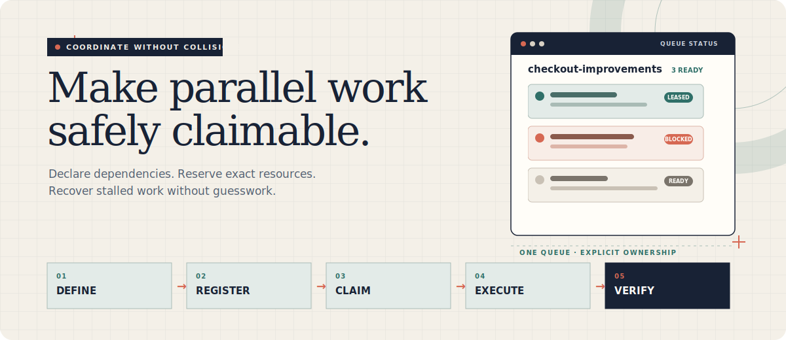
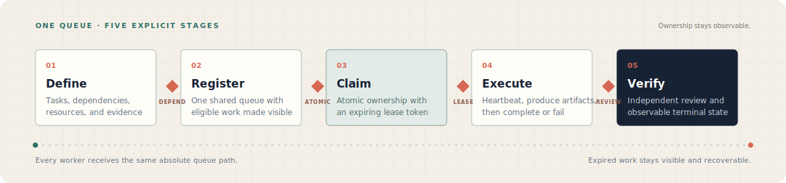

<p align="center">
  
</p>

<h1 align="center">Manage Agent Queue</h1>

<p align="center">
  Coordinate concurrent coding agents with explicit ownership, dependencies, and recovery.
</p>

<p align="center">
  <a href="https://skills.sh/SwiftyJunnos/manage-agent-queue"></a>
  
  
</p>

```bash
npx skills add SwiftyJunnos/manage-agent-queue --skill manage-agent-queue
```

## Why this skill exists

Parallel agents are useful only when their work can be claimed independently and their coordination survives interruptions.

`manage-agent-queue` turns a body of work into one local, file-backed queue with explicit dependencies, priorities, resource ownership, leases, and recovery. Coordinators can see what is ready, workers can prove what they own, and interrupted work remains inspectable instead of disappearing into chat history.

> [!IMPORTANT]
> This skill manages coordination state only. It does not start agents or execute their tasks; the calling agent remains responsible for dispatch and supervision.

## How it works

<p align="center">
  
</p>

| Stage | Produces | Moves on when |
| --- | --- | --- |
| **Define** | Verifiable tasks with dependencies, priorities, resources, and acceptance criteria | Each task has one bounded responsibility |
| **Register** | One shared queue and generated human-readable projection | Eligible work is visible to every worker |
| **Claim** | Atomic ownership with an agent ID, token, and expiry | The worker can prove an active lease |
| **Execute** | Heartbeats, artifacts, and a completion or failure record | The claimed scope has fresh evidence |
| **Verify** | Independent review and an observable terminal state | Required work passes its acceptance criteria |

Expired leases, failed work, and stale local artifacts remain explicit recovery cases. They can be inspected and retried without guessing which agent last held the work.

## Start from the work you have

You do not need to invent a coordination format before using the skill.

| Situation | Starting point |
| --- | --- |
| Several dependent tasks | Declare their blocking edges before dispatch |
| Work split across Git worktrees | Give every worker the same absolute queue path |
| Independent implementation shards | Use the `parallel-shards` workflow |
| Implementation plus isolated review | Use the `adversarial-review` workflow |
| An interrupted or stale queue | Inspect with `status`, `events`, `sweep`, and `doctor` |

## What it protects

- **Atomic ownership** — workers claim before side effects and prove ownership with opaque lease tokens.
- **Dependency order** — blocked tasks do not become eligible until their prerequisites finish successfully.
- **Resource isolation** — exact resource keys prevent active workers from claiming overlapping scope.
- **Git-aware ownership** — opt-in writer tasks bind a clean worktree, branch, starting HEAD, and typed `file:`/`dir:` scope.
- **Compact commit evidence** — completion validates descendant commits and scope while persisting counts instead of changed-path lists.
- **Lease discipline** — heartbeats extend live work; expired results are rejected instead of silently published.
- **Role independence** — implementers, reviewers, appliers, and verifiers receive only the context their role needs.
- **Observable recovery** — status, events, generated TSV, and diagnostics preserve a trail after interruption.

## Use the skill

Coordinate a multi-agent change:

```text
Use $manage-agent-queue to coordinate this work across agents.
Declare dependencies and exclusive resources before dispatching workers.
```

Run implementation with independent review:

```text
Use $manage-agent-queue with the adversarial-review workflow.
Keep implementer and reviewer context isolated, then verify the final result.
```

Recover interrupted work:

```text
Use $manage-agent-queue to inspect this existing queue, recover expired work,
and continue only the tasks that are still eligible.
```

When the skill offers live observation, approve it to open the read-only local dashboard. Decline it to keep progress in terminal `status` and `events` views.

Manual CLI example for an approved local dashboard:

```bash
CLI="python3 skills/manage-agent-queue/scripts/agent_queue.py --queue /absolute/path/queue.json"
$CLI serve --open
```

Git-aware work is explicit: add `--git-commit` with canonical `file:path` or `dir:path/` resources, claim from the intended clean worktree, then complete with `--commit FULL_COMMIT_ID` or `--no-change`. Expired Git work requires targeted `--resume-git`; the queue validates ownership but does not create worktrees, commit, merge, reset, or push.

## Outputs

The skill maintains a compact local coordination record:

- `queue.json` as the authoritative state;
- `queue.tsv` as a generated human-readable projection;
- sanitized events for progress and recovery history;
- compact Git base/head and commit/path counts for opted-in writer tasks;
- task artifacts referenced by path instead of embedded as large queue payloads;
- explicit completion, failure, blocking, retry, and cancellation states.

## Inside the skill

```text
skills/manage-agent-queue/
├── SKILL.md
├── agents/
│   └── openai.yaml
├── references/
│   ├── queue-schema.md
│   └── workflow-templates.md
└── scripts/
    ├── agent_queue.py
    ├── git_queue.py
    ├── queue_dashboard.py
    └── dashboard/
```

[`SKILL.md`](skills/manage-agent-queue/SKILL.md) owns the coordination protocol. Read the [queue schema and CLI contract](skills/manage-agent-queue/references/queue-schema.md) before changing state transitions, leases, retries, locks, diagnostics, or compaction. Read the [workflow templates](skills/manage-agent-queue/references/workflow-templates.md) before changing the bundled review or sharding flows.

## Runtime expectations

| Capability | Requirement |
| --- | --- |
| Queue state and CLI | Python 3; no third-party package installation |
| Shared coordination | One local filesystem and one explicit absolute queue path |
| Live dashboard | Optional browser access to a loopback-only read-only view |
| Agent execution | A separate agent runtime that can dispatch and supervise workers |

Schema version 2 adds opt-in Git-aware tasks while retaining version-1 generic queues through explicit migration. The runtime is designed for one machine and a local filesystem. It is not a distributed lock service, and assignment remains at-least-once—external side effects must be idempotent.

## Install and update

Install interactively:

```bash
npx skills add SwiftyJunnos/manage-agent-queue --skill manage-agent-queue
```

Install globally for Codex:

```bash
npx skills add SwiftyJunnos/manage-agent-queue \
  --skill manage-agent-queue \
  --agent codex \
  --global
```

Update an existing installation:

```bash
npx skills update manage-agent-queue
```

---

<p align="center">
  <strong>Make parallel work claimable before making it concurrent.</strong>
</p>
